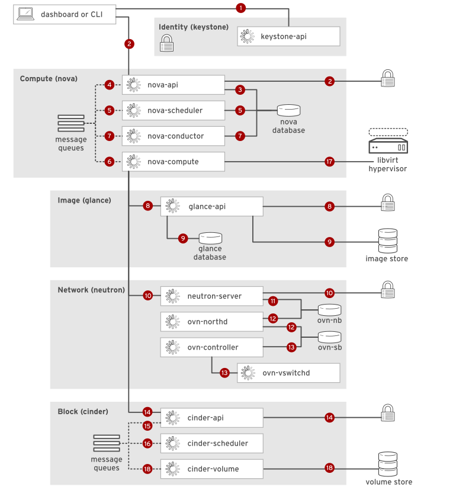

# Instance Launch Process

1. Using the dashboard or the command-line client, the user's account credentials are sent as a _REST API_ call to the identity service endpoint. After successful authentication, the identity service generates and returns an authentication token (auth token) to the user. The auth token is included with subsequent REST calls to other services, to permit those services to perform actions on behalf of this user.

2. The instance launch request and the auth token are sent as a _REST API_ call to the compute service endpoint. `nova_api` relays the request to the identity service, which validates the auth token and returns allowed roles and permissions in the updated token header.

3. `nova_api` creates a persistent database entry for the new instance, including the launch parameters in the original request. Other processes can obtain data from this entry, and update the current state to this persistent entry.

4. `nova_api` publishes a `rpc.call` to a named message queue, requesting `nova_scheduler` to locate an acceptable compute node to host the new instance.

5. `nova_scheduler` subscribes to the new instance request, reads filtering and weighing parameters from the instance database entry, reads cluster compute node data from the database, and updates the instance record with the selected compute host ID. `nova_scheduler` submits a `rpc.call` to a message queue, requesting that `nova_compute` initiate an instance launch.

6. `nova_compute` subscribes to the new instance request, then publishes a `rpc.call` for nova_conductor to prepare for an instance launch.

7. nova_conductor subscribes to the new instance request, reads the database entry to obtain the compute host ID and instance flavor with requested RAM, vCPUs, and disk configuration, and then publishes the new instance state to the message queue.

8. `nova_compute` subscribes to the new instance request to retrieve the instance information. Using the image ID from the instance request, `nova_compute` sends a _REST API_ call to the image service to obtain the requested image's URL. The `glance_api` service forwards the request to the identity service, which again validates the auth token and returns allowed roles and permissions in the updated token header.

9. Using the image ID, `glance_api` retrieves image metadata from the image service database and returns the image URL to `nova_compute`. `nova_compute` loads the image from the image store using the URL.

10. `nova_compute` sends a _REST API_ call to the networking service, requesting allocation and configuration of network resources for the new instance. `neutron_server` forwards the request to the identity service, which again validates the auth token and returns allowed roles and permissions in the updated token header.

11. `neutron_server`, as a cloud management system plug-in, reads and writes logical network resource definitions to the `ovn-nb` database. `neutron_server` checks for the existing network and creates new resources for needed ports, connections, and network parameters.

12. The `ovn-northd` daemon reads from `ovn-nb` and translates the logical network configuration into logical data-path flows in the `ovn-sb` database. The additional physical network and port bindings are populated by the `ovn-controller` on the selected compute host.

13. The `ovn-controller` reads the configuration from `ovn-sb` and updates the compute host's status in the physical network and the binding tables. `ovn-controller` connects to `ovs-vswitchd` as an OpenFlow controller to dynamically configure control over network traffic through OpenFlow rules on OVS bridges. `neutron_server` returns the L2 configuration obtained from the compute host libvirt driver, and the requested DHCP address, to the message queue. `nova_compute` writes this instance network state to the instance database entry.

14. `nova_compute` sends a _REST API_ call to the block storage service, requesting volume data for the new instance disks. `cinder_api` forwards the request to the identity service, which again validates the auth token and returns allowed roles and permissions in the updated token header.

15. `cinder_api` publishes a `rpc.call` to a named message queue, requesting that `cinder_scheduler` create a volume of the requested size, or to locate the volume metadata for a volume that already exists.

16. `cinder_scheduler` subscribes to the new instance request, creates or locates the volume, and then returns the requested metadata to `nova_scheduler`.

17. `nova_compute` generates data for the compute node driver and executes the request using libvirt to create a VM on the compute host. The VM appears in the dashboard and in commands that list servers. `nova_compute` passes the volume information to libvirt.

18. `cinder_volume` subscribes to the new instance request and retrieves the cluster map. libvirt then mounts the volume on the new instance.
